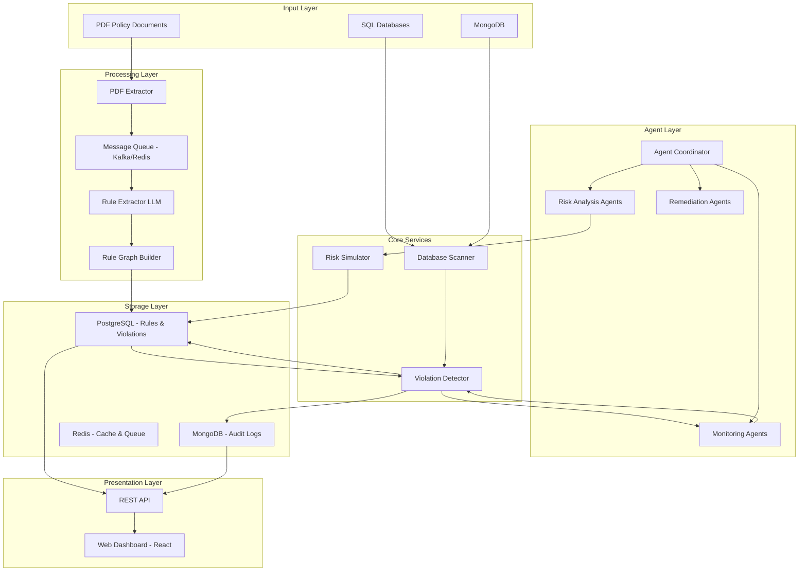

# Design Document: Compliance Monitoring Platform

## Overview

PolicySentinel is an AI-powered autonomous compliance agent that transforms unstructured PDF policies into executable rule graphs and continuously enforces them across enterprise databases. The system uses a multi-agent AI architecture for monitoring, risk forecasting, and automated governance.

The platform processes policy documents through LLM-based extraction, constructs structured rule graphs showing dependencies, maps rules to database schemas, and deploys autonomous monitoring agents for continuous compliance enforcement. When violations are detected, the system provides explainable justifications, simulates risk scenarios, and suggests remediation actions.

Key capabilities:
- **Intelligent Rule Extraction**: LLM-powered extraction of compliance rules from unstructured policy documents
- **Rule Graph Construction**: Structured representation of rules with dependency analysis
- **Multi-Agent Architecture**: Specialized AI agents for monitoring, risk analysis, and remediation
- **Continuous Monitoring**: Real-time violation detection across SQL and NoSQL databases
- **Risk Simulation**: Predictive analytics for proactive compliance management
- **Explainable AI**: Transparent decision-making with audit trails and confidence scores
- **Human-in-the-Loop**: Optional oversight workflows for critical decisions

The platform is designed for rapid development during a 5-day hackathon while maintaining production-quality architecture with clear extension points.

## Architecture

### High-Level Architecture



### Component Architecture

The system follows a multi-layered architecture with clear separation of concerns:

1. **Input Layer**: PDF documents and database connections
2. **Processing Layer**: Asynchronous document processing and rule extraction
3. **Agent Layer**: Multi-agent AI system for autonomous monitoring and analysis
4. **Core Services**: Violation detection, risk simulation, and database scanning
5. **Storage Layer**: Persistent storage for rules, violations, and audit logs
6. **Presentation Layer**: REST API and web dashboard

### Technology Stack

- **Backend**: Python 3.11+ with FastAPI (rapid development, async support, rich ecosystem)
- **Frontend**: React with Next.js (server-side rendering, modern UI)
- **PDF Processing**: pdfplumber (robust text extraction with layout preservation)
- **LLM Integration**: OpenAI GPT-4 or Google Gemini with LangChain (rule extraction, justification, remediation)
- **Database Layer**: 
  - PostgreSQL (structured storage for rules, violations, reports)
  - MongoDB (flexible storage for audit logs and document metadata)
  - SQLAlchemy (SQL database abstraction)
  - PyMongo (MongoDB integration)
- **Message Queue**: Kafka or Redis (asynchronous task processing)
- **Task Processing**: Celery (distributed task execution)
- **API Framework**: FastAPI (modern, fast, automatic API documentation)
- **Agent Framework**: LangChain with custom agent implementations
- **Caching**: Redis (session management, query caching)
- **Task Scheduling**: APScheduler (periodic monitoring jobs)
- **Deployment**: Docker + AWS/GCP (containerized deployment)

### Design Principles

1. **Asynchronous Processing**: Long-running tasks (PDF extraction, rule extraction, database scans) are queued and processed asynchronously
2. **Agent Autonomy**: Agents operate independently with coordination through the Agent Coordinator
3. **Explainability**: All AI decisions include confidence scores and reasoning traces
4. **Scalability**: Horizontal scaling through message queues and stateless services
5. **Resilience**: Retry logic, circuit breakers, and graceful degradation
6. **Audit-Ready**: Complete audit trails for all operations and AI decisions

## Components and Interfaces

### 1. PDF Extractor

**Responsibility**: Extract text content from PDF policy documents while preserving structure.

**Interface**:
```python
class PDFExtractor:
    def extract_text(self, pdf_path: str) -> ExtractedDocument:
        """
        Extract text from PDF with page numbers and structure.
        
        Args:
            pdf_path: Path to PDF file
            
        Returns:
            ExtractedDocument containing text, page numbers, and metadata
            
        Raises:
            PDFExtractionError: If PDF is corrupted or unreadable
        """
        pass
    
    def validate_pdf(self, pdf_path: str) -> bool:
        """
        Validate that file is a readable PDF under 50MB.
        
        Args:
            pdf_path: Path to PDF file
            
        Returns:
            True if valid, False otherwise
        """
        pass
```

**Key Design Decisions**:
- Use pdfplumber for text extraction (handles tables and layout better than PyPDF2)
- Preserve page numbers for rule traceability
- Validate file size and format before processing
- Extract text in chunks to handle large documents

### 2. Rule Extractor

**Responsibility**: Use LLM to identify and extract actionable compliance rules from policy text.

**Interface**:
```python
class RuleExtractor:
    def extract_rules(self, document: ExtractedDocument) -> List[ComplianceRule]:
        """
        Extract compliance rules from document text using LLM.
        
        Args:
            document: Extracted document with text and metadata
            
        Returns:
            List of ComplianceRule objects with descriptions and validation criteria
        """
        pass
    
    def parse_rule_to_logic(self, rule: ComplianceRule) -> RuleLogic:
        """
        Convert natural language rule to structured validation logic.
        
        Args:
            rule: ComplianceRule with natural language description
            
        Returns:
            RuleLogic with structured validation criteria
        """
        pass
```

**LLM Prompt Strategy**:
```
You are a compliance expert. Extract actionable compliance rules from the following policy text.

For each rule, provide:
1. Rule description (clear, concise statement)
2. Applicable data fields (what data this rule applies to)
3. Validation criteria (what conditions must be met)
4. Severity (critical, high, medium, low)

Policy text:
{document_text}

Return rules in JSON format.
```

**Key Design Decisions**:
- Use structured output from LLM (JSON format) for reliable parsing
- Two-stage extraction: identify rules, then convert to validation logic
- Include confidence scores from LLM to flag uncertain extractions
- Support user review and editing of extracted rules before activation

### 3. Database Scanner

**Responsibility**: Connect to company databases, discover schema, and retrieve records for scanning.

**Interface**:
```python
class DatabaseScanner:
    def connect(self, connection_string: str) -> None:
        """
        Establish connection to database.
        
        Args:
            connection_string: Database connection string
            
        Raises:
            DatabaseConnectionError: If connection fails
        """
        pass
    
    def discover_schema(self) -> DatabaseSchema:
        """
        Discover tables, columns, and data types.
        
        Returns:
            DatabaseSchema with complete schema information
        """
        pass
    
    def scan_records(self, table: str, columns: List[str], 
                     batch_size: int = 1000) -> Iterator[Record]:
        """
        Retrieve records from specified table in batches.
        
        Args:
            table: Table name to scan
            columns: Columns to retrieve
            batch_size: Number of records per batch
            
        Yields:
            Record objects with data from specified columns
        """
        pass
```

**Key Design Decisions**:
- Use SQLAlchemy for database abstraction (supports PostgreSQL, MySQL, SQL Server)
- Batch processing to handle large tables without memory issues
- Connection pooling for performance
- Schema caching to avoid repeated discovery queries

### 4. Violation Detector

**Responsibility**: Evaluate database records against compliance rules and detect violations.

**Interface**:
```python
class ViolationDetector:
    def evaluate_record(self, record: Record, rules: List[ComplianceRule]) -> List[Violation]:
        """
        Evaluate a single record against all applicable rules.
        
        Args:
            record: Database record to evaluate
            rules: List of compliance rules to check
            
        Returns:
            List of Violation objects (empty if compliant)
        """
        pass
    
    def generate_justification(self, violation: Violation, 
                               record: Record, rule: ComplianceRule) -> str:
        """
        Generate human-readable explanation for violation.
        
        Args:
            violation: Detected violation
            record: Record that violated the rule
            rule: Compliance rule that was violated
            
        Returns:
            Clear explanation of why the violation occurred
        """
        pass
```

**Rule Evaluation Engine**:
- Support common operators: equals, not_equals, greater_than, less_than, contains, regex_match
- Handle null/missing values gracefully
- Support multi-field rules with AND/OR logic
- Generate structured justifications with actual vs expected values

**Key Design Decisions**:
- Rule engine uses expression trees for complex logic
- Justifications generated using LLM for natural language quality
- Violations include full context (record ID, rule ID, timestamp, justification)
- Support for custom validation functions via plugin system

### 5. Rule Store

**Responsibility**: Persist compliance rules with versioning and audit trail.

**Database Schema**:
```sql
CREATE TABLE policy_documents (
    id UUID PRIMARY KEY,
    filename VARCHAR(255) NOT NULL,
    upload_timestamp TIMESTAMP NOT NULL,
    file_size_bytes INTEGER NOT NULL,
    file_hash VARCHAR(64) NOT NULL,
    status VARCHAR(50) NOT NULL
);

CREATE TABLE compliance_rules (
    id UUID PRIMARY KEY,
    policy_document_id UUID REFERENCES policy_documents(id),
    page_number INTEGER,
    description TEXT NOT NULL,
    validation_logic JSONB NOT NULL,
    severity VARCHAR(20) NOT NULL,
    is_active BOOLEAN DEFAULT true,
    created_at TIMESTAMP NOT NULL,
    updated_at TIMESTAMP NOT NULL
);

CREATE TABLE rule_mappings (
    id UUID PRIMARY KEY,
    rule_id UUID REFERENCES compliance_rules(id),
    table_name VARCHAR(255) NOT NULL,
    column_mappings JSONB NOT NULL,
    created_at TIMESTAMP NOT NULL
);
```

**Key Design Decisions**:
- Use JSONB for flexible validation logic storage
- Support rule versioning (soft deletes with is_active flag)
- Link rules back to source documents and page numbers for traceability
- Store column mappings separately for flexibility

### 6. Violation Store

**Responsibility**: Persist detected violations with full context and audit trail.

**Database Schema**:
```sql
CREATE TABLE violations (
    id UUID PRIMARY KEY,
    rule_id UUID REFERENCES compliance_rules(id),
    record_identifier VARCHAR(255) NOT NULL,
    table_name VARCHAR(255) NOT NULL,
    detected_at TIMESTAMP NOT NULL,
    status VARCHAR(50) NOT NULL,
    justification TEXT NOT NULL,
    record_snapshot JSONB NOT NULL,
    severity VARCHAR(20) NOT NULL
);

CREATE TABLE violation_reviews (
    id UUID PRIMARY KEY,
    violation_id UUID REFERENCES violations(id),
    reviewer_user_id VARCHAR(255) NOT NULL,
    action VARCHAR(50) NOT NULL,
    reason TEXT,
    reviewed_at TIMESTAMP NOT NULL
);

CREATE TABLE monitoring_jobs (
    id UUID PRIMARY KEY,
    job_name VARCHAR(255) NOT NULL,
    schedule_config JSONB NOT NULL,
    last_run_at TIMESTAMP,
    next_run_at TIMESTAMP,
    status VARCHAR(50) NOT NULL
);

CREATE TABLE job_executions (
    id UUID PRIMARY KEY,
    job_id UUID REFERENCES monitoring_jobs(id),
    started_at TIMESTAMP NOT NULL,
    completed_at TIMESTAMP,
    records_scanned INTEGER,
    violations_detected INTEGER,
    status VARCHAR(50) NOT NULL,
    error_message TEXT
);
```

**Key Design Decisions**:
- Store record snapshot (JSONB) for point-in-time violation context
- Separate violation reviews for audit trail
- Track monitoring job executions for reliability and debugging
- Use status field for workflow (pending_review, confirmed, dismissed, resolved)

**Additional Schema for PolicySentinel Features**:
```sql
-- Rule Graph Tables
CREATE TABLE rule_graphs (
    id UUID PRIMARY KEY,
    created_at TIMESTAMP NOT NULL,
    has_circular_dependencies BOOLEAN DEFAULT false
);

CREATE TABLE rule_nodes (
    id UUID PRIMARY KEY,
    graph_id UUID REFERENCES rule_graphs(id),
    rule_id UUID REFERENCES compliance_rules(id),
    input_fields JSONB NOT NULL,
    output_fields JSONB NOT NULL
);

CREATE TABLE rule_edges (
    id UUID PRIMARY KEY,
    graph_id UUID REFERENCES rule_graphs(id),
    from_rule_id UUID REFERENCES compliance_rules(id),
    to_rule_id UUID REFERENCES compliance_rules(id),
    dependency_type VARCHAR(50) NOT NULL
);

-- Agent Management Tables
CREATE TABLE agents (
    id UUID PRIMARY KEY,
    agent_type VARCHAR(50) NOT NULL,
    status VARCHAR(50) NOT NULL,
    current_task_id UUID,
    created_at TIMESTAMP NOT NULL,
    last_heartbeat TIMESTAMP NOT NULL
);

CREATE TABLE tasks (
    id UUID PRIMARY KEY,
    task_type VARCHAR(50) NOT NULL,
    payload JSONB NOT NULL,
    status VARCHAR(50) NOT NULL,
    created_at TIMESTAMP NOT NULL,
    started_at TIMESTAMP,
    completed_at TIMESTAMP,
    assigned_agent_id UUID REFERENCES agents(id),
    retry_count INTEGER DEFAULT 0,
    error_message TEXT
);

-- Risk Forecasting Tables
CREATE TABLE risk_forecasts (
    id UUID PRIMARY KEY,
    rule_id UUID REFERENCES compliance_rules(id),
    forecast_date TIMESTAMP NOT NULL,
    probability_score FLOAT NOT NULL,
    confidence_interval_lower FLOAT NOT NULL,
    confidence_interval_upper FLOAT NOT NULL,
    supporting_data JSONB NOT NULL,
    created_at TIMESTAMP NOT NULL
);

CREATE TABLE trend_analyses (
    id UUID PRIMARY KEY,
    time_window_start TIMESTAMP NOT NULL,
    time_window_end TIMESTAMP NOT NULL,
    total_violations INTEGER NOT NULL,
    violations_by_rule JSONB NOT NULL,
    violations_by_severity JSONB NOT NULL,
    trend_direction VARCHAR(50) NOT NULL,
    created_at TIMESTAMP NOT NULL
);

CREATE TABLE patterns (
    id UUID PRIMARY KEY,
    trend_analysis_id UUID REFERENCES trend_analyses(id),
    pattern_type VARCHAR(50) NOT NULL,
    description TEXT NOT NULL,
    frequency INTEGER NOT NULL,
    confidence_score FLOAT NOT NULL
);

-- AI Audit Trail (MongoDB Collection Schema)
-- Stored in MongoDB for flexible schema and high write throughput
{
    "_id": ObjectId,
    "operation_type": "rule_extraction | justification | remediation",
    "timestamp": ISODate,
    "llm_model": "gpt-4 | gemini-pro",
    "prompt": "string",
    "response": "string",
    "confidence_score": 0.0-1.0,
    "user_id": "string",
    "related_entity_id": "UUID",
    "metadata": {}
}
```

### 7. REST API

**Responsibility**: Provide HTTP interface for all system operations.

**Key Endpoints**:
```
POST   /api/v1/documents/upload          # Upload policy document
GET    /api/v1/documents                 # List policy documents
GET    /api/v1/documents/{id}/rules      # Get extracted rules

POST   /api/v1/rules                     # Create/update rule
GET    /api/v1/rules                     # List all rules
PUT    /api/v1/rules/{id}/mapping        # Configure rule mapping
PUT    /api/v1/rules/{id}/activate       # Activate rule

POST   /api/v1/database/connect          # Configure database connection
GET    /api/v1/database/schema           # Get database schema

POST   /api/v1/monitoring/jobs           # Create monitoring job
GET    /api/v1/monitoring/jobs           # List monitoring jobs
POST   /api/v1/monitoring/jobs/{id}/run  # Trigger manual scan

GET    /api/v1/violations                # List violations (with filters)
GET    /api/v1/violations/{id}           # Get violation details
PUT    /api/v1/violations/{id}/review    # Review violation

GET    /api/v1/reports/compliance        # Generate compliance report
GET    /api/v1/reports/audit-trail       # Get audit trail
```

**Key Design Decisions**:
- RESTful design with resource-based URLs
- JWT authentication for API access
- Pagination for list endpoints
- Filter support for violations (by date, rule, status, severity)
- Async endpoints for long-running operations (document processing, scans)

### 8. Monitoring Job Scheduler

**Responsibility**: Execute periodic compliance scans on schedule.

**Interface**:
```python
class MonitoringScheduler:
    def schedule_job(self, job_config: JobConfig) -> str:
        """
        Schedule a periodic monitoring job.
        
        Args:
            job_config: Configuration including schedule, rules, and tables
            
        Returns:
            Job ID for tracking
        """
        pass
    
    def execute_job(self, job_id: str) -> JobExecution:
        """
        Execute a monitoring job immediately.
        
        Args:
            job_id: ID of job to execute
            
        Returns:
            JobExecution with results
        """
        pass
```

**Key Design Decisions**:
- Use APScheduler for cron-like scheduling
- Support daily, weekly, monthly schedules
- Retry logic for transient failures (3 retries with exponential backoff)
- Job execution history for debugging and audit
- Concurrent job execution with configurable limits

### 9. Rule Graph Builder

**Responsibility**: Construct structured graph representation of compliance rules showing dependencies and relationships.

**Interface**:
```python
class RuleGraphBuilder:
    def build_graph(self, rules: List[ComplianceRule]) -> RuleGraph:
        """
        Build rule graph from extracted compliance rules.
        
        Args:
            rules: List of compliance rules
            
        Returns:
            RuleGraph with nodes and edges representing dependencies
        """
        pass
    
    def detect_dependencies(self, rule1: ComplianceRule, rule2: ComplianceRule) -> bool:
        """
        Determine if rule1 depends on rule2.
        
        Args:
            rule1: First compliance rule
            rule2: Second compliance rule
            
        Returns:
            True if rule1 depends on rule2's output
        """
        pass
    
    def detect_circular_dependencies(self, graph: RuleGraph) -> List[List[str]]:
        """
        Detect circular dependencies in rule graph.
        
        Args:
            graph: Rule graph to analyze
            
        Returns:
            List of circular dependency chains (empty if none found)
        """
        pass
```

**Key Design Decisions**:
- Use directed acyclic graph (DAG) structure for rule dependencies
- Detect dependencies by analyzing rule inputs/outputs and field references
- Flag circular dependencies for user review before activation
- Support graph visualization using D3.js or similar library
- Enable topological sorting for optimal rule evaluation order

### 10. Agent Coordinator

**Responsibility**: Orchestrate multiple specialized AI agents for autonomous compliance monitoring.

**Interface**:
```python
class AgentCoordinator:
    def register_agent(self, agent: Agent, agent_type: AgentType) -> str:
        """
        Register a new agent with the coordinator.
        
        Args:
            agent: Agent instance to register
            agent_type: Type of agent (monitoring, risk_analysis, remediation)
            
        Returns:
            Agent ID for tracking
        """
        pass
    
    def route_task(self, task: Task) -> str:
        """
        Route task to appropriate agent based on task type.
        
        Args:
            task: Task to be executed
            
        Returns:
            Task ID for tracking
        """
        pass
    
    def handle_agent_failure(self, agent_id: str, task_id: str) -> None:
        """
        Handle agent failure by reassigning task to another agent.
        
        Args:
            agent_id: ID of failed agent
            task_id: ID of task that failed
        """
        pass
```

**Agent Types**:
1. **Monitoring Agents**: Continuously scan databases for violations
2. **Risk Analysis Agents**: Analyze trends and forecast potential risks
3. **Remediation Agents**: Generate and suggest remediation actions

**Key Design Decisions**:
- Use LangChain agent framework for agent implementation
- Implement message passing via Redis pub/sub for agent communication
- Support dynamic agent scaling based on workload
- Maintain agent health monitoring with automatic failover
- Store agent state in Redis for recovery after failures

### 11. Risk Simulator

**Responsibility**: Forecast potential compliance risks based on historical data and trends.

**Interface**:
```python
class RiskSimulator:
    def analyze_trends(self, violations: List[Violation], 
                       time_window_days: int = 90) -> TrendAnalysis:
        """
        Analyze violation trends over specified time window.
        
        Args:
            violations: Historical violations
            time_window_days: Number of days to analyze
            
        Returns:
            TrendAnalysis with patterns and statistics
        """
        pass
    
    def forecast_risks(self, trend_analysis: TrendAnalysis, 
                       forecast_days: int = 30) -> List[RiskForecast]:
        """
        Forecast potential future violations based on trends.
        
        Args:
            trend_analysis: Historical trend analysis
            forecast_days: Number of days to forecast
            
        Returns:
            List of risk forecasts with probability scores
        """
        pass
    
    def calculate_confidence_interval(self, forecast: RiskForecast) -> Tuple[float, float]:
        """
        Calculate confidence interval for risk forecast.
        
        Args:
            forecast: Risk forecast to analyze
            
        Returns:
            Tuple of (lower_bound, upper_bound) for 95% confidence interval
        """
        pass
```

**Forecasting Approach**:
- Time series analysis using ARIMA or Prophet for trend forecasting
- Pattern recognition to identify recurring violation patterns
- Probability scoring based on historical frequency and severity
- Confidence intervals using statistical methods
- Accuracy tracking by comparing forecasts to actual violations

**Key Design Decisions**:
- Use Prophet library for time series forecasting (handles seasonality and trends)
- Store forecast accuracy metrics for continuous improvement
- Generate forecasts daily for proactive risk management
- Provide confidence scores and supporting data for transparency
- Alert on high-probability forecasts for critical rules

### 12. Message Queue Integration

**Responsibility**: Manage asynchronous task processing using Kafka or Redis.

**Interface**:
```python
class MessageQueueManager:
    def publish_task(self, task: Task, queue_name: str) -> str:
        """
        Publish task to message queue for asynchronous processing.
        
        Args:
            task: Task to be processed
            queue_name: Name of queue to publish to
            
        Returns:
            Task ID for tracking
        """
        pass
    
    def subscribe_to_queue(self, queue_name: str, 
                           handler: Callable[[Task], None]) -> None:
        """
        Subscribe to queue and process tasks with handler.
        
        Args:
            queue_name: Name of queue to subscribe to
            handler: Function to process tasks
        """
        pass
    
    def get_task_status(self, task_id: str) -> TaskStatus:
        """
        Get current status of task.
        
        Args:
            task_id: ID of task to check
            
        Returns:
            TaskStatus with current state and progress
        """
        pass
```

**Queue Types**:
1. **pdf_extraction_queue**: PDF text extraction tasks
2. **rule_extraction_queue**: LLM-based rule extraction tasks
3. **monitoring_queue**: Database scanning and violation detection tasks
4. **risk_analysis_queue**: Risk simulation and forecasting tasks

**Key Design Decisions**:
- Use Kafka for high-throughput production deployments
- Use Redis for simpler deployments and development
- Implement Celery workers for task execution
- Support task prioritization (critical rules processed first)
- Provide real-time status updates via WebSocket

## Data Models

### Core Data Models

```python
@dataclass
class ExtractedDocument:
    """Document extracted from PDF."""
    document_id: str
    filename: str
    pages: List[PageContent]
    upload_timestamp: datetime
    file_hash: str

@dataclass
class PageContent:
    """Content from a single PDF page."""
    page_number: int
    text: str
    tables: List[Table]

@dataclass
class ComplianceRule:
    """Compliance rule extracted from policy."""
    rule_id: str
    policy_document_id: str
    page_number: int
    description: str
    validation_logic: RuleLogic
    severity: Severity
    is_active: bool
    created_at: datetime

@dataclass
class RuleLogic:
    """Structured validation logic for a rule."""
    target_fields: List[str]
    operator: Operator
    expected_value: Any
    conditions: List[Condition]

@dataclass
class Violation:
    """Detected compliance violation."""
    violation_id: str
    rule_id: str
    record_identifier: str
    table_name: str
    detected_at: datetime
    status: ViolationStatus
    justification: str
    record_snapshot: Dict[str, Any]
    severity: Severity

@dataclass
class JobExecution:
    """Result of a monitoring job execution."""
    execution_id: str
    job_id: str
    started_at: datetime
    completed_at: Optional[datetime]
    records_scanned: int
    violations_detected: int
    status: ExecutionStatus
    error_message: Optional[str]

# Enums
class Severity(Enum):
    CRITICAL = "critical"
    HIGH = "high"
    MEDIUM = "medium"
    LOW = "low"

class ViolationStatus(Enum):
    PENDING_REVIEW = "pending_review"
    CONFIRMED = "confirmed"
    DISMISSED = "dismissed"
    RESOLVED = "resolved"

class ExecutionStatus(Enum):
    RUNNING = "running"
    COMPLETED = "completed"
    FAILED = "failed"

class Operator(Enum):
    EQUALS = "equals"
    NOT_EQUALS = "not_equals"
    GREATER_THAN = "greater_than"
    LESS_THAN = "less_than"
    CONTAINS = "contains"
    NOT_CONTAINS = "not_contains"
    REGEX_MATCH = "regex_match"
    IS_NULL = "is_null"
    IS_NOT_NULL = "is_not_null"
```

### New Data Models for PolicySentinel

```python
@dataclass
class RuleGraph:
    """Graph representation of compliance rules with dependencies."""
    graph_id: str
    nodes: List[RuleNode]
    edges: List[RuleEdge]
    created_at: datetime
    has_circular_dependencies: bool

@dataclass
class RuleNode:
    """Node in rule graph representing a compliance rule."""
    node_id: str
    rule_id: str
    rule_description: str
    input_fields: List[str]
    output_fields: List[str]

@dataclass
class RuleEdge:
    """Edge in rule graph representing dependency between rules."""
    edge_id: str
    from_rule_id: str
    to_rule_id: str
    dependency_type: DependencyType

@dataclass
class Agent:
    """AI agent for autonomous compliance monitoring."""
    agent_id: str
    agent_type: AgentType
    status: AgentStatus
    current_task_id: Optional[str]
    created_at: datetime
    last_heartbeat: datetime

@dataclass
class Task:
    """Asynchronous task for processing."""
    task_id: str
    task_type: TaskType
    payload: Dict[str, Any]
    status: TaskStatus
    created_at: datetime
    started_at: Optional[datetime]
    completed_at: Optional[datetime]
    assigned_agent_id: Optional[str]
    retry_count: int
    error_message: Optional[str]

@dataclass
class RiskForecast:
    """Forecasted compliance risk."""
    forecast_id: str
    rule_id: str
    forecast_date: datetime
    probability_score: float
    confidence_interval_lower: float
    confidence_interval_upper: float
    supporting_data: Dict[str, Any]
    created_at: datetime

@dataclass
class TrendAnalysis:
    """Analysis of violation trends."""
    analysis_id: str
    time_window_start: datetime
    time_window_end: datetime
    total_violations: int
    violations_by_rule: Dict[str, int]
    violations_by_severity: Dict[str, int]
    trend_direction: TrendDirection
    patterns: List[Pattern]

@dataclass
class Pattern:
    """Identified pattern in violation data."""
    pattern_id: str
    pattern_type: PatternType
    description: str
    frequency: int
    confidence_score: float

# Additional Enums
class DependencyType(Enum):
    DATA_DEPENDENCY = "data_dependency"
    LOGICAL_DEPENDENCY = "logical_dependency"
    TEMPORAL_DEPENDENCY = "temporal_dependency"

class AgentType(Enum):
    MONITORING = "monitoring"
    RISK_ANALYSIS = "risk_analysis"
    REMEDIATION = "remediation"

class AgentStatus(Enum):
    IDLE = "idle"
    BUSY = "busy"
    FAILED = "failed"
    OFFLINE = "offline"

class TaskType(Enum):
    PDF_EXTRACTION = "pdf_extraction"
    RULE_EXTRACTION = "rule_extraction"
    DATABASE_SCAN = "database_scan"
    RISK_ANALYSIS = "risk_analysis"
    REMEDIATION_GENERATION = "remediation_generation"

class TaskStatus(Enum):
    QUEUED = "queued"
    RUNNING = "running"
    COMPLETED = "completed"
    FAILED = "failed"
    RETRYING = "retrying"

class TrendDirection(Enum):
    INCREASING = "increasing"
    DECREASING = "decreasing"
    STABLE = "stable"
    VOLATILE = "volatile"

class PatternType(Enum):
    RECURRING = "recurring"
    SEASONAL = "seasonal"
    ANOMALY = "anomaly"
    CORRELATION = "correlation"
```

## Correctness Properties

*A property is a characteristic or behavior that should hold true across all valid executions of a system—essentially, a formal statement about what the system should do. Properties serve as the bridge between human-readable specifications and machine-verifiable correctness guarantees.*

### Property 1: File Upload Validation

*For any* file upload attempt, files under 50MB with valid PDF format should be accepted, and files over 50MB or with invalid format should be rejected with descriptive error messages.

**Validates: Requirements 1.1, 1.2**

### Property 2: Document Storage Uniqueness

*For any* successfully uploaded policy document, the system should store it with a unique identifier that differs from all other stored documents, and include an accurate timestamp.

**Validates: Requirements 1.4**

### Property 3: Multiple Document Support

*For any* compliance monitoring configuration, multiple policy documents should be uploadable and stored independently without conflicts.

**Validates: Requirements 1.5**

### Property 4: Extracted Rule Completeness

*For any* extracted compliance rule, it should contain a description, applicable data fields, validation criteria, source document reference, and page number.

**Validates: Requirements 2.2, 2.3**

### Property 5: Database Connection Validation

*For any* valid database connection credentials, the system should successfully establish a connection and discover the complete schema including tables, columns, and data types.

**Validates: Requirements 3.1, 3.2**

### Property 6: Complete Record Evaluation

*For any* monitoring job execution, all relevant database records should be evaluated against all active compliance rules without skipping records.

**Validates: Requirements 4.1**

### Property 7: Violation Structure Completeness

*For any* detected violation, the system should create a violation entry containing record identifier, rule identifier, timestamp, justification, and record snapshot.

**Validates: Requirements 4.2, 4.3**

### Property 8: Multi-Rule Violation Detection

*For any* database record that violates multiple compliance rules, the system should detect and create separate violation entries for each violated rule.

**Validates: Requirements 4.4**

### Property 9: Justification Completeness

*For any* generated violation justification, it should include the specific rule violated, the actual data values that caused the violation, and the expected values or conditions from the rule.

**Validates: Requirements 5.1, 5.2, 5.3**

### Property 10: Incremental Violation Detection

*For any* scheduled monitoring job execution, the system should detect new violations that occurred since the last scan without re-reporting previously detected violations.

**Validates: Requirements 6.2**

### Property 11: Job Execution Metadata

*For any* completed monitoring job, the system should record execution timestamp, number of records scanned, and number of violations detected.

**Validates: Requirements 6.3**

### Property 12: Manual Job Triggering

*For any* monitoring job, manual triggering should execute the job immediately regardless of the scheduled interval.

**Validates: Requirements 6.5**

### Property 13: Oversight Status Configuration

*For any* detected violation, the status should be set to "pending_review" when human oversight is enabled, and "confirmed" when human oversight is disabled.

**Validates: Requirements 7.1, 7.4**

### Property 14: Dismissal Reason Requirement

*For any* violation dismissal action, the system should require a reason to be provided and store it in the audit trail.

**Validates: Requirements 7.3**

### Property 15: Compliance Report Completeness

*For any* generated compliance report, it should include total violations grouped by rule and severity, trend data over time, and calculated overall compliance rate as a percentage.

**Validates: Requirements 8.1, 8.2, 8.3**

### Property 16: Report Filtering Accuracy

*For any* compliance report with filter criteria (date range, specific rules, or database tables), all returned violations should match the filter criteria and no matching violations should be excluded.

**Validates: Requirements 8.4**

### Property 17: Remediation Configuration

*For any* detected violation, remediation steps should be generated when remediation suggestions are enabled, and omitted when remediation suggestions are disabled.

**Validates: Requirements 9.1, 9.5**

### Property 18: Remediation Progress Tracking

*For any* remediation step marked as completed, the system should record the completion status and timestamp for progress tracking.

**Validates: Requirements 9.4**

### Property 19: Audit Log Immutability

*For any* monitoring job execution, the system should create an audit log entry with timestamp, user, and results that cannot be modified after creation.

**Validates: Requirements 10.1**

### Property 20: Status Change Audit Trail

*For any* violation status change, the system should record the change, timestamp, user, and reason in the audit trail.

**Validates: Requirements 10.2**

### Property 21: Audit Trail Chronological Ordering

*For any* audit trail query, results should be returned in chronological order from oldest to newest or newest to oldest.

**Validates: Requirements 10.3**

### Property 22: Audit Report Completeness

*For any* audit report with a specified time period, all audit trail entries within that time period should be included in the report.

**Validates: Requirements 10.5**

### Property 23: Dashboard Metric Accuracy

*For any* dashboard display, the total number of active violations, grouping by severity or rule, and trend data for the past 30 days should accurately reflect the current state of the violation store.

**Validates: Requirements 11.1, 11.2, 11.3**

### Property 24: Rule Mapping Creation

*For any* extracted compliance rule, the system should allow mapping to one or more database tables and columns, and store the mapping configuration.

**Validates: Requirements 12.1**

### Property 25: Field Validation in Mapping

*For any* rule mapping attempt, the system should validate that specified database fields exist in the connected database schema before allowing the mapping to be saved.

**Validates: Requirements 12.2**

### Property 26: Complex Rule Mapping Support

*For any* compliance rule involving multiple fields and conditional logic (AND/OR operations), the system should correctly store and evaluate the complex mapping.

**Validates: Requirements 12.4**

### Property 27: Mapping Configuration Validation

*For any* rule mapping save attempt, the system should validate the complete configuration (fields exist, operators are valid, expected values match field types) before activation.

**Validates: Requirements 12.5**

### Property 28: Error Logging Completeness

*For any* monitoring job error, the system should log detailed error information including error type, message, timestamp, and context for troubleshooting.

**Validates: Requirements 13.2**

### Property 29: Error Isolation in Record Processing

*For any* monitoring job where a compliance rule evaluation fails for a specific record, the system should continue processing remaining records without stopping the entire job.

**Validates: Requirements 13.3**

### Property 30: Rule Graph Construction

*For any* set of extracted compliance rules, the system should construct a rule graph that accurately represents dependencies between rules based on their input and output fields.

**Validates: Requirements 14.1, 14.2**

### Property 31: Circular Dependency Detection

*For any* rule graph, the system should detect and flag all circular dependencies before rules are activated.

**Validates: Requirements 14.3**

### Property 32: Rule Graph Updates

*For any* compliance rule update, the system should update the rule graph to reflect changes in dependencies without requiring full graph reconstruction.

**Validates: Requirements 14.5**

### Property 33: Trend Analysis Accuracy

*For any* set of historical violations within a specified time window, the risk simulator should accurately calculate violation counts by rule and severity, and identify trend direction.

**Validates: Requirements 15.1**

### Property 34: Risk Forecast Generation

*For any* trend analysis, the risk simulator should generate risk forecasts with probability scores and confidence intervals for the specified forecast period.

**Validates: Requirements 15.2, 15.3, 15.4**

### Property 35: Forecast Accuracy Tracking

*For any* risk forecast that materializes as an actual violation, the system should update the risk simulator's accuracy metrics to reflect prediction performance.

**Validates: Requirements 15.5**

### Property 36: Agent Registration and Management

*For any* agent registered with the agent coordinator, the system should track the agent's type, status, and current task assignment.

**Validates: Requirements 16.1**

### Property 37: Task Routing

*For any* task submitted to the agent coordinator, the system should route it to an appropriate agent based on the task type and agent availability.

**Validates: Requirements 16.2**

### Property 38: Agent Failover

*For any* agent failure during task execution, the agent coordinator should reassign the task to another available agent of the same type without data loss.

**Validates: Requirements 16.5**

### Property 39: Asynchronous Task Queuing

*For any* long-running task (PDF extraction, rule extraction, monitoring job), the system should queue the task for asynchronous processing and provide a task ID for tracking.

**Validates: Requirements 17.1, 17.2**

### Property 40: Task Status Tracking

*For any* queued task, the system should provide real-time status updates showing current state (queued, running, completed, failed).

**Validates: Requirements 17.4**

### Property 41: Worker Retry on Failure

*For any* task that fails during worker processing, the system should retry the task on a different worker up to a configured maximum retry count.

**Validates: Requirements 17.5**

### Property 42: Multi-Database Connection Support

*For any* valid connection credentials for PostgreSQL, MySQL, SQL Server, or MongoDB, the system should successfully establish a connection and discover the schema.

**Validates: Requirements 18.1, 18.2**

### Property 43: MongoDB Document Schema Handling

*For any* MongoDB collection, the database scanner should discover document schemas and the violation detector should correctly evaluate rules against document-based data structures.

**Validates: Requirements 18.3**

### Property 44: Multi-Database Violation Aggregation

*For any* monitoring job scanning multiple databases, the system should aggregate violations across all connected databases and present them in a unified view.

**Validates: Requirements 18.5**

### Property 45: Continuous Monitoring Detection Latency

*For any* new data inserted into monitored databases, the system should detect and evaluate it against compliance rules within 5 minutes when continuous monitoring is enabled.

**Validates: Requirements 19.2**

### Property 46: Monitoring State Persistence

*For any* system restart, the continuous monitoring system should resume from its last known state without losing progress or re-processing already evaluated records.

**Validates: Requirements 19.3**

### Property 47: AI Decision Audit Trail

*For any* AI-generated output (rule extraction, justification, remediation suggestion), the system should log the prompts, responses, and confidence scores for audit purposes.

**Validates: Requirements 20.1, 20.3**

### Property 48: AI Reasoning Explainability

*For any* violation detected by AI, the system should provide an explanation of the AI's reasoning process including the data and logic used to reach the decision.

**Validates: Requirements 20.2, 20.4**

## Error Handling

### Error Categories

The system handles errors in four categories:

1. **User Input Errors**: Invalid file uploads, malformed connection strings, invalid rule mappings
2. **External System Errors**: Database connection failures, LLM API failures, network timeouts
3. **Processing Errors**: PDF extraction failures, rule evaluation errors, data type mismatches
4. **System Errors**: Out of memory, disk full, unhandled exceptions

### Error Handling Strategies

**User Input Errors**:
- Validate all inputs before processing
- Return descriptive error messages with guidance on how to fix
- Never expose internal system details in error messages
- Log validation failures for security monitoring

**External System Errors**:
- Implement retry logic with exponential backoff (3 retries for database, 2 retries for LLM)
- Graceful degradation when optional services fail (e.g., remediation suggestions)
- Circuit breaker pattern for repeated failures to external services
- Detailed logging of external service failures for debugging

**Processing Errors**:
- Isolate errors to prevent cascade failures (one bad record doesn't stop job)
- Store partial results when possible (e.g., extract rules from readable pages)
- Generate error reports for manual review of failed items
- Maintain system state consistency even when processing fails

**System Errors**:
- Global exception handler to catch unhandled exceptions
- Automatic notification to administrators for critical errors
- Graceful shutdown procedures to prevent data corruption
- Health check endpoints for monitoring system status

### Specific Error Scenarios

**PDF Upload Failures**:
```python
try:
    validate_pdf(file_path)
    document = extract_text(file_path)
except FileSizeExceededError:
    return Error("File size exceeds 50MB limit. Please upload a smaller file.")
except InvalidPDFFormatError:
    return Error("File is not a valid PDF. Please upload a PDF document.")
except CorruptedPDFError:
    return Error("PDF file is corrupted or unreadable. Please try a different file.")
```

**Database Connection Failures**:
```python
def connect_with_retry(connection_string: str, max_retries: int = 3) -> Connection:
    for attempt in range(max_retries):
        try:
            return establish_connection(connection_string)
        except ConnectionError as e:
            if attempt == max_retries - 1:
                log_error(f"Failed to connect after {max_retries} attempts: {e}")
                raise DatabaseConnectionError(
                    "Unable to connect to database. Please verify credentials and network connectivity."
                )
            time.sleep(2 ** attempt)  # Exponential backoff
```

**Rule Evaluation Failures**:
```python
def evaluate_records(records: List[Record], rules: List[Rule]) -> List[Violation]:
    violations = []
    for record in records:
        for rule in rules:
            try:
                if not evaluate_rule(record, rule):
                    violations.append(create_violation(record, rule))
            except RuleEvaluationError as e:
                log_error(f"Failed to evaluate rule {rule.id} for record {record.id}: {e}")
                # Continue processing other rules and records
                continue
    return violations
```

**LLM API Failures**:
```python
def extract_rules_with_fallback(document: ExtractedDocument) -> List[ComplianceRule]:
    try:
        return extract_rules_via_llm(document)
    except LLMAPIError as e:
        log_error(f"LLM API failed: {e}")
        # Fallback to keyword-based extraction or manual review
        return extract_rules_via_keywords(document)
    except LLMTimeoutError:
        log_error("LLM API timeout")
        # Queue for retry later
        queue_for_retry(document)
        return []
```

## Testing Strategy

### Dual Testing Approach

The system requires both unit testing and property-based testing for comprehensive coverage:

- **Unit tests**: Verify specific examples, edge cases, and error conditions
- **Property tests**: Verify universal properties across all inputs

Unit tests catch concrete bugs in specific scenarios, while property tests verify general correctness across a wide range of inputs. Both are necessary and complementary.

### Unit Testing

**Focus Areas**:
- Specific examples demonstrating correct behavior
- Edge cases (empty files, null values, boundary conditions)
- Error conditions (corrupted PDFs, invalid credentials, connection failures)
- Integration points between components

**Example Unit Tests**:
```python
def test_pdf_upload_rejects_oversized_file():
    """Test that files over 50MB are rejected."""
    large_file = create_test_pdf(size_mb=51)
    result = upload_document(large_file)
    assert result.is_error()
    assert "50MB limit" in result.error_message

def test_violation_includes_justification():
    """Test that violations include justifications."""
    rule = create_test_rule()
    record = create_violating_record()
    violation = detect_violation(record, rule)
    assert violation.justification is not None
    assert len(violation.justification) > 0

def test_database_connection_retry():
    """Test that connection failures trigger retries."""
    mock_db = MockDatabase(fail_count=2)
    connection = connect_with_retry(mock_db.connection_string)
    assert mock_db.connection_attempts == 3
    assert connection.is_connected()
```

**Unit Test Guidelines**:
- Keep unit tests focused on specific scenarios
- Don't write excessive unit tests - property tests handle broad coverage
- Focus on integration points and error conditions
- Use mocks for external dependencies (LLM, database)

### Property-Based Testing

**Testing Library**: Use Hypothesis (Python's property-based testing library)

**Configuration**: Each property test should run minimum 100 iterations to ensure comprehensive input coverage

**Property Test Structure**:
```python
from hypothesis import given, strategies as st

@given(st.text(min_size=1, max_size=1000))
def test_property_extracted_rules_have_required_fields(policy_text):
    """
    Property 4: Extracted Rule Completeness
    For any extracted compliance rule, it should contain description,
    data fields, validation criteria, source document, and page number.
    
    Feature: compliance-monitoring-platform, Property 4
    Validates: Requirements 2.2, 2.3
    """
    document = create_document_from_text(policy_text)
    rules = extract_rules(document)
    
    for rule in rules:
        assert rule.description is not None
        assert len(rule.description) > 0
        assert rule.applicable_fields is not None
        assert rule.validation_criteria is not None
        assert rule.policy_document_id == document.id
        assert rule.page_number > 0
```

**Property Test Guidelines**:
- Each correctness property from the design must have exactly one property test
- Tag each test with: **Feature: compliance-monitoring-platform, Property {number}: {property_text}**
- Reference the requirements validated by the property
- Run minimum 100 iterations per test
- Use appropriate Hypothesis strategies for input generation
- Focus on invariants that should hold for all valid inputs

**Key Property Tests**:

1. **File Upload Validation** (Property 1): Generate files of various sizes and formats, verify acceptance/rejection
2. **Document Storage Uniqueness** (Property 2): Generate multiple uploads, verify unique IDs
3. **Violation Structure** (Property 7): Generate various violations, verify all required fields present
4. **Multi-Rule Detection** (Property 8): Generate records violating multiple rules, verify all detected
5. **Report Filtering** (Property 16): Generate violations and filter criteria, verify filtering accuracy
6. **Audit Trail Ordering** (Property 21): Generate audit entries, verify chronological ordering
7. **Error Isolation** (Property 29): Generate records with some causing errors, verify processing continues
8. **Rule Graph Construction** (Property 30): Generate rules with dependencies, verify graph accuracy
9. **Circular Dependency Detection** (Property 31): Generate rules with circular dependencies, verify detection
10. **Risk Forecast Generation** (Property 34): Generate historical violations, verify forecast accuracy
11. **Agent Failover** (Property 38): Simulate agent failures, verify task reassignment
12. **Multi-Database Aggregation** (Property 44): Generate violations across multiple databases, verify aggregation

### Additional Property Tests for PolicySentinel

**Rule Graph Testing**:
```python
from hypothesis import given, strategies as st

@given(st.lists(st.builds(ComplianceRule), min_size=2, max_size=10))
def test_property_rule_graph_construction(rules):
    """
    Property 30: Rule Graph Construction
    For any set of extracted compliance rules, the system should construct
    a rule graph that accurately represents dependencies.
    
    Feature: compliance-monitoring-platform, Property 30
    Validates: Requirements 14.1, 14.2
    """
    graph = build_rule_graph(rules)
    
    # Verify all rules are represented as nodes
    assert len(graph.nodes) == len(rules)
    
    # Verify dependencies are correctly identified
    for edge in graph.edges:
        from_rule = get_rule_by_id(rules, edge.from_rule_id)
        to_rule = get_rule_by_id(rules, edge.to_rule_id)
        assert has_dependency(from_rule, to_rule)
```

**Agent Coordination Testing**:
```python
@given(st.lists(st.builds(Task), min_size=1, max_size=20))
def test_property_task_routing(tasks):
    """
    Property 37: Task Routing
    For any task submitted to the agent coordinator, the system should
    route it to an appropriate agent based on task type.
    
    Feature: compliance-monitoring-platform, Property 37
    Validates: Requirements 16.2
    """
    coordinator = AgentCoordinator()
    
    # Register agents of different types
    monitoring_agent = register_agent(coordinator, AgentType.MONITORING)
    risk_agent = register_agent(coordinator, AgentType.RISK_ANALYSIS)
    
    for task in tasks:
        assigned_agent_id = coordinator.route_task(task)
        assigned_agent = coordinator.get_agent(assigned_agent_id)
        
        # Verify task is routed to correct agent type
        if task.task_type == TaskType.DATABASE_SCAN:
            assert assigned_agent.agent_type == AgentType.MONITORING
        elif task.task_type == TaskType.RISK_ANALYSIS:
            assert assigned_agent.agent_type == AgentType.RISK_ANALYSIS
```

**Risk Forecasting Testing**:
```python
@given(st.lists(st.builds(Violation), min_size=10, max_size=100))
def test_property_risk_forecast_generation(violations):
    """
    Property 34: Risk Forecast Generation
    For any trend analysis, the risk simulator should generate forecasts
    with probability scores and confidence intervals.
    
    Feature: compliance-monitoring-platform, Property 34
    Validates: Requirements 15.2, 15.3, 15.4
    """
    simulator = RiskSimulator()
    trend_analysis = simulator.analyze_trends(violations, time_window_days=90)
    forecasts = simulator.forecast_risks(trend_analysis, forecast_days=30)
    
    for forecast in forecasts:
        # Verify probability score is valid
        assert 0.0 <= forecast.probability_score <= 1.0
        
        # Verify confidence interval is valid
        assert forecast.confidence_interval_lower <= forecast.probability_score
        assert forecast.probability_score <= forecast.confidence_interval_upper
        
        # Verify supporting data is present
        assert forecast.supporting_data is not None
        assert len(forecast.supporting_data) > 0
```

### Integration Testing

**Focus Areas**:
- End-to-end workflows (upload PDF → extract rules → scan database → generate report)
- Component interactions (Rule Extractor → Rule Store → Violation Detector)
- External system integration (database connections, LLM API calls)

**Example Integration Tests**:
```python
def test_end_to_end_compliance_workflow():
    """Test complete workflow from PDF upload to violation detection."""
    # Upload policy document
    pdf_path = "test_policy.pdf"
    document = upload_document(pdf_path)
    
    # Extract rules
    rules = extract_rules(document)
    assert len(rules) > 0
    
    # Map rules to database
    for rule in rules:
        map_rule_to_table(rule, "employees", ["salary", "department"])
    
    # Run monitoring job
    job = create_monitoring_job(rules)
    execution = execute_job(job.id)
    
    # Verify violations detected
    assert execution.status == ExecutionStatus.COMPLETED
    violations = get_violations_for_job(execution.id)
    assert len(violations) > 0
    
    # Verify audit trail
    audit_entries = get_audit_trail(job.id)
    assert len(audit_entries) > 0
```

**PolicySentinel Integration Tests**:

```python
def test_rule_graph_workflow():
    """Test rule graph construction and dependency analysis."""
    # Upload and extract rules
    document = upload_document("test_policy.pdf")
    rules = extract_rules(document)
    
    # Build rule graph
    graph = build_rule_graph(rules)
    assert graph is not None
    assert len(graph.nodes) == len(rules)
    
    # Verify circular dependency detection
    circular_deps = detect_circular_dependencies(graph)
    if graph.has_circular_dependencies:
        assert len(circular_deps) > 0
    else:
        assert len(circular_deps) == 0

def test_multi_agent_monitoring_workflow():
    """Test multi-agent coordination for compliance monitoring."""
    # Initialize agent coordinator
    coordinator = AgentCoordinator()
    
    # Register agents
    monitoring_agent = coordinator.register_agent(
        Agent(agent_type=AgentType.MONITORING), 
        AgentType.MONITORING
    )
    risk_agent = coordinator.register_agent(
        Agent(agent_type=AgentType.RISK_ANALYSIS),
        AgentType.RISK_ANALYSIS
    )
    
    # Create monitoring task
    task = Task(
        task_type=TaskType.DATABASE_SCAN,
        payload={"database": "test_db", "rules": ["rule1", "rule2"]}
    )
    
    # Route and execute task
    task_id = coordinator.route_task(task)
    assert task_id is not None
    
    # Verify task assignment
    task_status = get_task_status(task_id)
    assert task_status.assigned_agent_id == monitoring_agent

def test_risk_forecasting_workflow():
    """Test risk simulation and forecasting."""
    # Generate historical violations
    violations = generate_test_violations(count=100, days=90)
    
    # Analyze trends
    simulator = RiskSimulator()
    trend_analysis = simulator.analyze_trends(violations, time_window_days=90)
    
    assert trend_analysis.total_violations == 100
    assert trend_analysis.trend_direction in [
        TrendDirection.INCREASING,
        TrendDirection.DECREASING,
        TrendDirection.STABLE,
        TrendDirection.VOLATILE
    ]
    
    # Generate forecasts
    forecasts = simulator.forecast_risks(trend_analysis, forecast_days=30)
    assert len(forecasts) > 0
    
    for forecast in forecasts:
        assert 0.0 <= forecast.probability_score <= 1.0
        assert forecast.confidence_interval_lower <= forecast.confidence_interval_upper

def test_async_processing_workflow():
    """Test asynchronous task processing with message queues."""
    # Initialize message queue
    queue_manager = MessageQueueManager()
    
    # Publish PDF extraction task
    task = Task(
        task_type=TaskType.PDF_EXTRACTION,
        payload={"pdf_path": "test_policy.pdf"}
    )
    task_id = queue_manager.publish_task(task, "pdf_extraction_queue")
    
    # Wait for task completion
    max_wait = 30  # seconds
    start_time = time.time()
    while time.time() - start_time < max_wait:
        status = queue_manager.get_task_status(task_id)
        if status.status == TaskStatus.COMPLETED:
            break
        time.sleep(1)
    
    # Verify task completed
    final_status = queue_manager.get_task_status(task_id)
    assert final_status.status == TaskStatus.COMPLETED
    assert final_status.completed_at is not None

def test_multi_database_monitoring():
    """Test monitoring across SQL and NoSQL databases."""
    # Connect to multiple databases
    pg_scanner = DatabaseScanner()
    pg_scanner.connect("postgresql://localhost/test_db")
    
    mongo_scanner = DatabaseScanner()
    mongo_scanner.connect("mongodb://localhost/test_db")
    
    # Discover schemas
    pg_schema = pg_scanner.discover_schema()
    mongo_schema = mongo_scanner.discover_schema()
    
    assert len(pg_schema.tables) > 0
    assert len(mongo_schema.collections) > 0
    
    # Run monitoring job across both databases
    job = create_multi_database_job([pg_scanner, mongo_scanner], rules)
    execution = execute_job(job.id)
    
    # Verify violations aggregated from both databases
    violations = get_violations_for_job(execution.id)
    pg_violations = [v for v in violations if v.database_type == "postgresql"]
    mongo_violations = [v for v in violations if v.database_type == "mongodb"]
    
    assert len(violations) == len(pg_violations) + len(mongo_violations)

def test_ai_explainability_workflow():
    """Test AI decision logging and explainability."""
    # Extract rules with AI
    document = upload_document("test_policy.pdf")
    rules = extract_rules(document)
    
    # Verify AI audit trail
    audit_logs = get_ai_audit_logs(operation_type="rule_extraction")
    assert len(audit_logs) > 0
    
    latest_log = audit_logs[0]
    assert latest_log.prompt is not None
    assert latest_log.response is not None
    assert 0.0 <= latest_log.confidence_score <= 1.0
    assert latest_log.llm_model in ["gpt-4", "gemini-pro"]
    
    # Detect violation and verify explainability
    violation = detect_test_violation()
    explanation = get_ai_explanation(violation.violation_id)
    
    assert explanation.reasoning_process is not None
    assert explanation.data_used is not None
    assert explanation.logic_applied is not None
```

### Test Coverage Goals

- **Unit Test Coverage**: 80% code coverage minimum
- **Property Test Coverage**: 100% of correctness properties must have property tests
- **Integration Test Coverage**: All major workflows covered
- **Edge Case Coverage**: All error conditions and edge cases from requirements

### Continuous Testing

- Run unit tests on every commit
- Run property tests (with reduced iterations) on every commit
- Run full property test suite (100+ iterations) nightly
- Run integration tests before deployment
- Monitor test execution time and optimize slow tests

